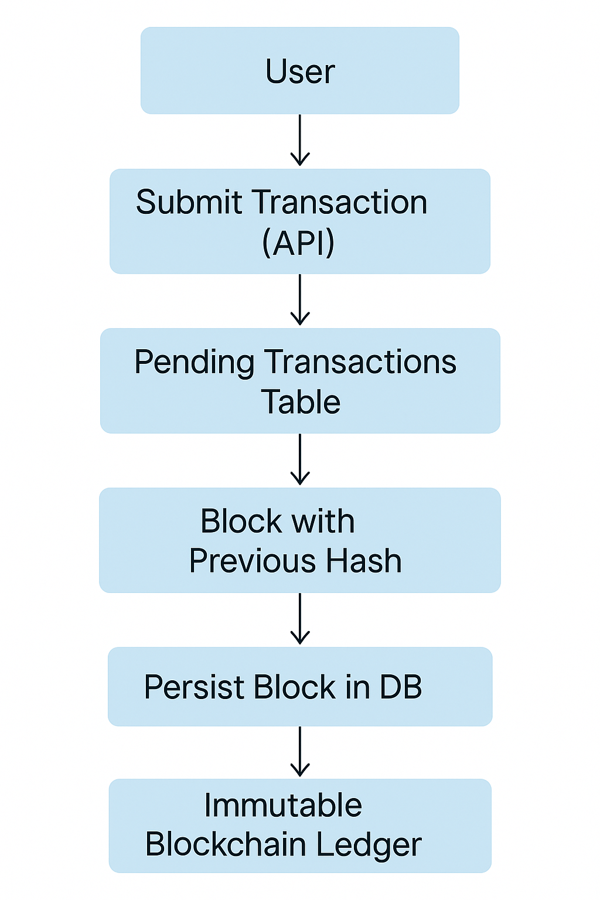

# 🔗 Blockchain Ledger System

A simplified blockchain-based ledger application built with **Go**, **GORM**, **MySQL**, and **Gorilla Mux**. This project demonstrates how blockchain principles like immutability, hashing, and transaction verification can be implemented in a backend system.

---

## 🧠 Overview

This system allows users to submit transactions which are later grouped into blocks. Each block includes a hash of the previous block to ensure tamper resistance. This mimics how blockchains maintain a secure, verifiable chain of records.

---

## 🛠️ Tech Stack

- **Go (Golang)** — backend logic and concurrency
- **GORM** — ORM for MySQL
- **MySQL** — database for storing transactions and blocks
- **Gorilla Mux** — HTTP routing
- **Docker**  — containerization for deployment

---

## ✨ Features

- Submit new transactions
- Automatically create new blocks after a set of transactions
- Link blocks using SHA-256 hashes
- Prevent tampering by enforcing chain integrity
- API access to view transactions and blocks

---

## 🧱 Architecture Diagram


## 🚀 Getting Started

### Prerequisites

- Go 1.18+
- MySQL server
- Git

### Setup

```bash
# Clone the project
git clone https://github.com/Shriharsh07/Chain-Track.git
cd Chain-Track

# Install dependencies
go mod tidy
```

## 🐳 Docker Setup

This project comes with a `docker-compose.yml` file to help you spin up the entire stack — API and MySQL — quickly and cleanly.

### 📁 Files Involved

- **`Dockerfile`** – Builds the Go application using a multi-stage setup.
- **`docker-compose.yml`** – Defines and links the `api` and `db` services.
- **`.env` (optional)** – Can be used to manage environment variables securely.

---

### 🧱 Services Defined

#### 1. `api` – Go Application

- Built from the local `Dockerfile`.
- Runs the blockchain ledger service on port `8080`.
- Connects to the MySQL container using the internal Docker network.
- Waits for the database to become healthy before starting.

#### 2. `db` – MySQL 8 Database

- Exposes MySQL on port `3307` (host) mapped to `3306` (container).
- Uses root credentials and initializes the `chaintrack` database.
- Persists data using a named Docker volume `db_data`.
- Has a health check to ensure readiness before the API connects.

---

### ⚙️ Environment Variables
All required environment variables for both the API and the database are defined directly in the docker-compose.yml file.
Here's an example of how they're declared:

```
services:
  api:
    environment:
      - DB_USER=root
      - DB_PASS=password
      - DB_NAME=chaintrack
      - DB_HOST=db
      - DB_PORT=3306

  db:
    environment:
      - MYSQL_ROOT_PASSWORD=password
      - MYSQL_DATABASE=chaintrack
```

### ➕ Adding More Variables
To add more environment variables, simply edit the api or db section in docker-compose.yml:
```
environment:
  - NEW_ENV_VAR=value
```

### ▶️ How to Run with Docker

```bash
# Build and start containers
docker-compose up --build
```

#### The API will be accessible at: http://localhost:8080
---

## 🧑‍💻 Swagger Documentation

This project includes Swagger UI for easy access to the API documentation.

### 🚀 Accessing Swagger UI
Once the project is up and running, you can access the Swagger documentation at the following URL:
```
http://localhost:8080/swagger/index.html
```
#### This UI allows you to:
 
- View all available API endpoints
- See the structure of requests and responses
- Test the API directly from the UI

### Swagger UI is configured using the Go-swagger library. Here’s a breakdown of how it works:

- Annotations: All API endpoints have been documented with Swaggo annotations.

- API Documentation Generation: The annotations are used to generate interactive API documentation.

- Swagger JSON: The Swagger specification is available at: http://localhost:8080/swagger/doc.json.
You can use this JSON to import into other tools like Postman or Redoc if needed.